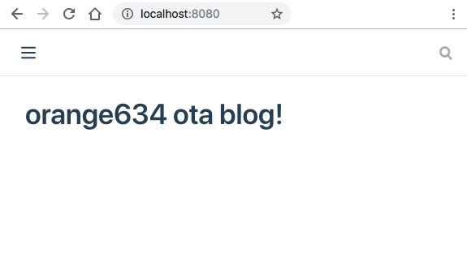

VuePress
---

公式：https://v1.vuepress.vuejs.org/

## よく見るページ

### config refarence

https://v1.vuepress.vuejs.org/config/

vue press のコンフィグのレファレンス

### markdown

https://vuepress.vuejs.org/guide/using-vue.html#browser-api-access-restrictions

一般的なマークダウン記法に加え独自機構も用意

### custom theme

https://vuepress.vuejs.org/guide/custom-themes.html#site-and-page-metadata

テーマをカスタムする方法について書かれている

## 参考

### 記事一覧

- [VuePressに移行した](https://to-hutohu.com/2018/05/18/migrate-to-vuepress)
- [Adding a Recent Content Component to VuePress](https://www.raymondcamden.com/2018/05/09/adding-a-recent-content-component-to-vuepress)

### カスタマイズ

[VuePressはコーダーの夢を見るか。](https://qiita.com/gollowars/items/845baa30ceb7cc035919)
[webサイト制作環境が変わる！VuePress入門](https://qiita.com/sa-k0/items/4e0fca341b91c1fefe54)

あんまり公式ドキュメントに書かれてないカスタマイズについて書かれていて役にたった

## Netlify CMS

ちょっとずつだがVuepressと合わせて使えないか実験中

公式：https://www.netlifycms.org/

カスタムプレビュー：https://www.netlifycms.org/docs/customization/
プレビューの確認もできるみたい：https://www.netlifycms.org/docs/deploy-preview-links/

---

## 試した時のログ

ちょっと使う予定があるので試してみました。

とりあえず公式をやってみる。
https://vuepress.vuejs.org/guide/getting-started.html

今回はプロジェクトに入れる方法にします。（後々のビルドのことを考えて）

```console
$ yarn init
// 色々入力
$ yarn add -D vuepress
$ mkdir docs
$ echo '# orange634 ota blog!' > docs/README.md
$ vi package.json
//  "scripts": {
//    "docs:dev": "vuepress dev docs",
//    "docs:build": "vuepress build docs"
//  },
$ yarn docs:dev
```

これで開発環境は立ち上がったみたいです。
`http://localhost:8080`にアクセスします。



それぽい。

ビルドする際は以下を実行します。

```console
$ yarn docs:build
```

すると、`docs/.vuepress/dist`に出力されます。

```console
$ ls docs/.vuepress/dist/
404.html	assets/		index.html
```

一旦`.gitignore`を追加して、gitにコミット。
`dist`以下のファイルは含めないで、デプロイ時にビルドする方法にしようと思う。

```.gitignore
.DS_Store
node_modules
*.log
.temp
TODOs.md
vuepress
dist
```

# configをいじってみる

次にconfig周りをいじりたいと思います。
https://vuepress.vuejs.org/guide/basic-config.html#config-file

`docs/.vuepress/config.js`にファイルを作ります。

```javascript:config.js
module.exports = {
  title: 'orange634 ota blog',
  description: 'my otaku blog made by vue press.'
}
```

